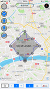
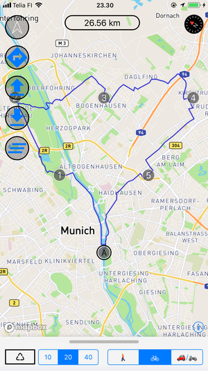
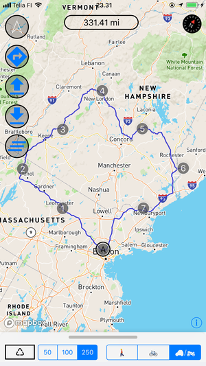
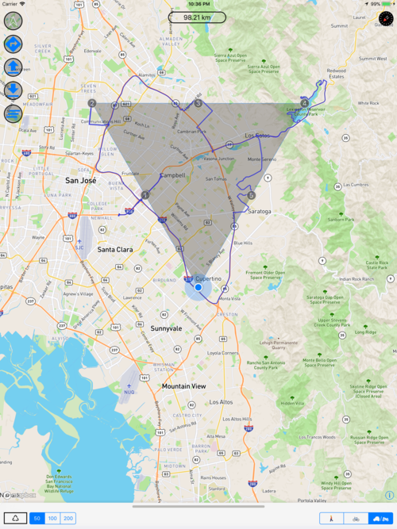
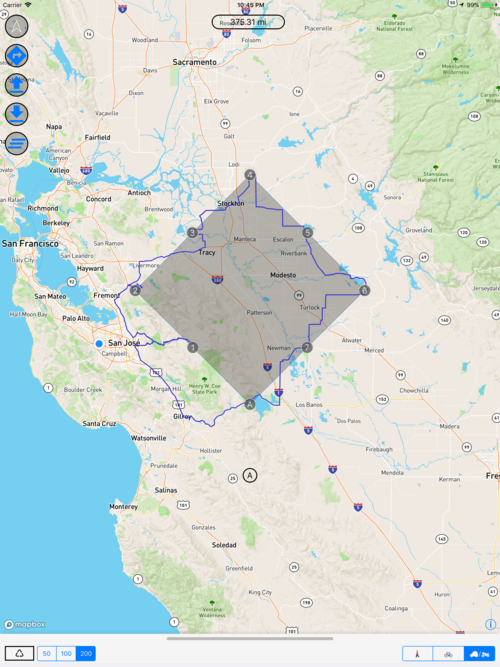

# A-to-A
        
 

  

When You Want To Go To Where You Already Are.

A-to-A is an iOS application to find you new routes.

## Example use cases

- You are at home and want to go for a walk. Use this app to find new route not yet walked.
- Same applies if you are using car, motorcycle or bicycle.
- You are a tourist in a foreign city. Find a new route from your hotel and back.

## Premium subscription

Premium features include routes for walking and cycling.

## Using the app

App should be easy to use :-)

- Buttons on left: 
  - Go to current location
  - Start navigation
  - Load route
  - Save route
  - Clear route

Various settings in drawer view. Purchase Premium also in drawer view.

When in navigation screen, tap route to reroute to the next waypoint.

## Credits

This app uses [Mapbox](https://www.mapbox.com) SDK and services.

App icon made by Vectors Market from [www.flaticon.com](https://www.flaticon.com) is licensed by CC 3.0 BY.

Many open source libraries are used in the app. See Credits in the app.

## Images of iPhone app

  

## Images of iPad app

